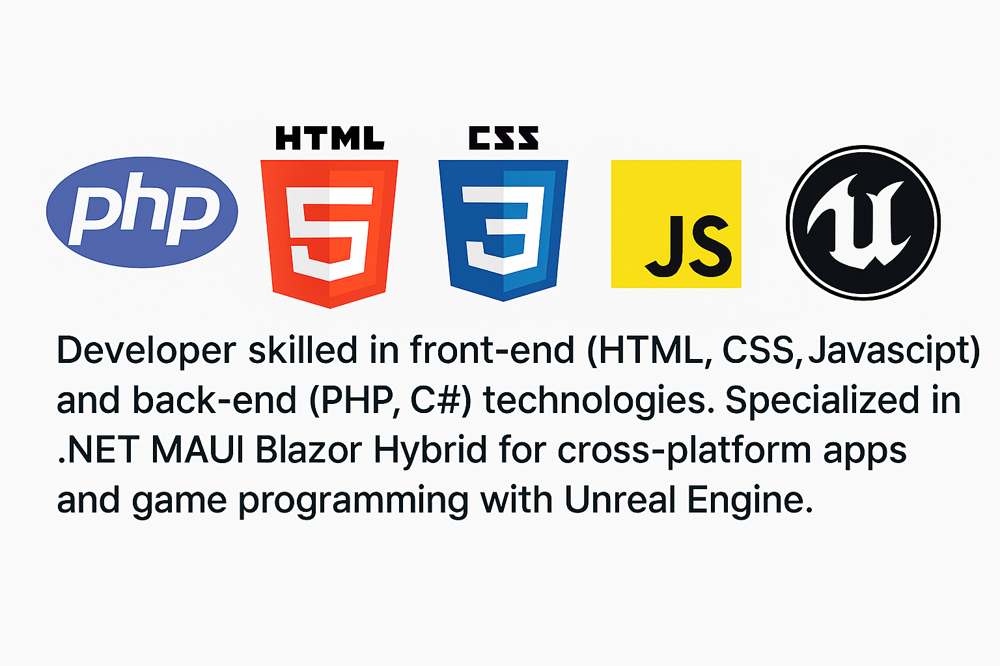

# 👨‍💻 Developer Portfolio

## About Me

I'm a passionate developer with a strong foundation in both front-end and back-end technologies. My expertise spans across:

- **Front-End Development**: HTML, CSS, JavaScript
- **Back-End Development**: PHP, C#
- **Cross-Platform Applications**: .NET MAUI Blazor Hybrid
- **Game Programming**: Creating interactive and immersive digital experiences

I enjoy building scalable web and mobile applications, and I'm always exploring new technologies to enhance user experiences.

## 🔧 Technologies & Tools

- **Languages**: PHP, JavaScript, C#
- **Frameworks**: .NET MAUI, Blazor, Laravel
- **Web**: HTML5, CSS3, Bootstrap
- **Game Dev**: Unreal Engine
- **Version Control**: Git & GitHub

## 📫 Let's Connect

Feel free to reach out or explore my repositories to see my work in action. I'm always open to collaboration and new opportunities!

