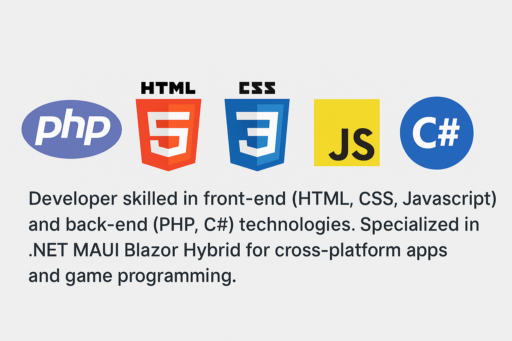

# 👨‍💻 Full-Stack Developer Portfolio

## 👋 About Me

I'm a passionate **Full-Stack Developer** dedicated to building scalable web, mobile, and cross-platform applications. With a strong foundation in both front-end and back-end architectures, I enjoy solving complex problems and optimizing user experiences.

- 💻 **Core Expertise**: Full-stack development with a strong focus on **C#**, **PHP**, and modern web technologies.
- 📱 **Cross-Platform**: Building seamless native mobile and desktop apps using **.NET MAUI Blazor Hybrid**.
- 🗄️ **Data Management**: Experienced in structuring and managing relational databases like **MySQL** and **PostgreSQL**.
- 🎮 **Game Development**: Passionate about game programming and actively expanding my skills in **Unreal Engine**.

I am always exploring new tools and methodologies to write cleaner code and build better systems.

## 🔧 Technologies & Tools

Here are the main technologies I work with on a daily basis:

- **Languages**: C#, PHP, JavaScript, TypeScript, HTML5, CSS3
- **Frameworks & Libraries**: .NET MAUI, Blazor, Laravel, Bootstrap
- **Databases**: MySQL, PostgreSQL
- **Game Dev**: Unreal Engine
- **Tools & Version Control**: Git, GitHub

## 📫 Let's Connect

I'm always open to discussing new projects, creative ideas, or opportunities to be part of your vision. Feel free to reach out or explore my repositories to see my code in action!

  
  

